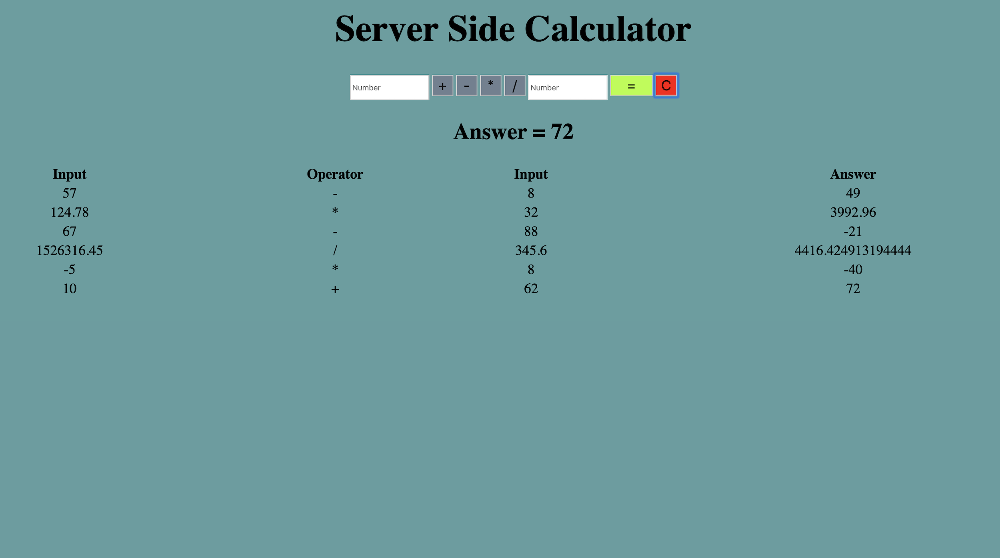

# JQuery-Server-Side-Calculator

## Description
Duration: 15 hours

The Server-Side-Calculator is a web application. It acts as a basic calculator, making its calculations and storing a history of user problems on the server.

## Screen Shots

## Usage
 1. Type a number into both of the input fields.
 2. Click an operator button.
 3. Click the equal sign button.
 4. The calculator will provide you with your answer, as well as a history of all the calculations you have ran.
 5. Don't like the numbers or operator you chose, click on the clear button(AKA: The Big Red Button) and enter the input you desire.  
 6. Feel free to close out your browser and come back. The Calculator will still have your history, the Calculator REMEMBERS.

## Built With
Html, CSS, Javascript, jquery-3.4.1, Node, Express, Body Parser.

## Acknowledgement
Thanks to Prime Digital Academy in Kansas City who equipped and helped me to make this application a reality. Specifically Scott, Myron, and the Tyto cohort.

## Support
If you have suggestions or issues, please email me at allenlucke@gmail.com
